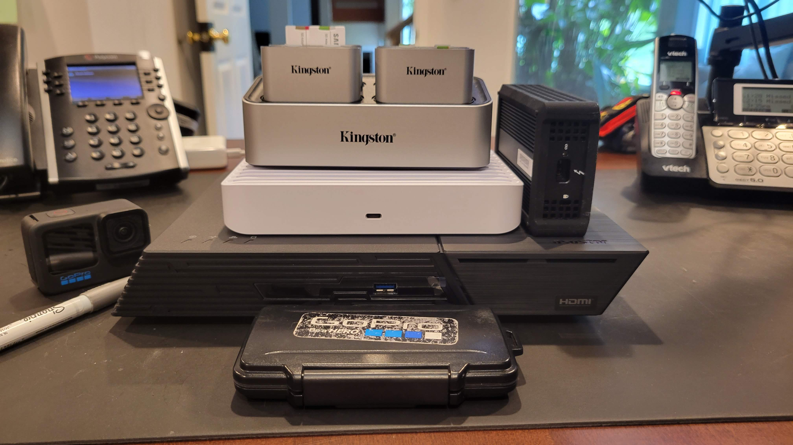

# flashstor
Creating a Asustor Flashstor Pro 12 to import SD Cards




[Austor Flashstor Pro 12](https://www.asustor.com/en/product?p_id=80) is a NVMe Flash Based NAS from Austor. It can hold 12 M.2 NVMe drives and supports 32gb of SODIM memory. The bootloader is unlocked and you can install any OS you want. I have chosen to install [ProxMox](https://www.proxmox.com/en/) as the host. On ProxMox I created a ZFS-2 array uinsg 11 Crucial 2TB NVMe drives. The 12th drive is the system drive. I have then mounted the ZFS drive in 2 other LXC containers. Container 1 is a vanila arch linux with Samba installed so I can share the ZFS volume over my network and the 2nd container is running [Plex](https://www.plex.tv/) from [tteck](https://tteck.github.io/Proxmox/). The Plex server is so I can view the media after it has been imported.

# Design Goals

The goal for this build was to have a portal NAS I could take into the field while recording audio and video and offload quickly in the evenings. Sometimes I will have upwards of 20 SD Cards that need to be offloaded and cataloged. Doing this one at a time or several at a time with various card readers from a laptop was proving time consuming and error prone. Previous iteration of this was a Synology NAS with a 4 bay card reader attached to the USB port, then using the Synology file manager to copy files from the SD Cards onto the internal Array. This worked well but I was loosing a spinning drive almost every time the NAS was relocated. So the decision was made to invest in NVMe drives and save the Synology for a single location backup. I also wanted something that could be edited from directly, the Synology was to slow to edit multiple 4k streams from.

# Hardware
 - 1x  [Austor Flashstor Pro 12](https://www.asustor.com/en/product?p_id=80)
 - 2x  [Crucial 16GB SODIMM](https://www.crucial.com/memory/ddr4/ct16g4sfra32a) - The Datasheet for the CPU states 16GB max but after running memtest86 on the 32 and testing proxmox the 32GB is working and being utilized
 - 12x [Crucial P3 Plus 2TB PCIe M.2 2280 SSD](https://www.crucial.com/ssd/p3-plus/ct2000p3pssd8) - 1 for System, 11 for ZFS Storage
 - 1x  [OWC Thunderbolt 3 10G Ethernet Adapter](https://www.owc.com/solutions/thunderbolt-3-10g-ethernet-adapter) - For connecting the laptop to the Flashstor
 - 1x [Unifi Switch Flex XG](https://store.ui.com/us/en/products/unifi-flex-xg) - 10 GB Switch for the Flashstor, Laptop and main internet
 - 1x [Kingston Workflow Station](https://www.kingston.com/en/memory-card-readers/workflow-station-hub) - Hub for SD Cards Readers
 - 4x [Kingston Workflow microSD Readers](https://www.kingston.com/en/memory-card-readers/workflow-station-hub) - These got into the Hub and have support for 2 microSD cards each for a total of 8 microSD cards at once

# Software
 - ProxMox VE on Host
 - Arch Linux in LXC hosting Samba
 - Ubuntu Linux in LXC hosting Plex

Custom Scripts for importing SD Cards and rsyncing, located in this repo

# Building

Hardware all Gathered up


Installing the NVMe drives and Ram


The rest of the NVMes

# Usage

## Setup ProxMox
I like to automount the SDCards, on ProxMox you need to edit the following file,
```bash
nano /etc/udev/rules.d/99-sdcard-automount.rules
```
Then add this entry
```bash
# Generic rule for any SD card
ACTION=="add", SUBSYSTEM=="block", ENV{ID_FS_USAGE}=="filesystem", ENV{ID_FS_LABEL}=="?*", RUN+="/usr/bin/systemd-mount --no-block --automount=yes --collect $devnode /media/$env{ID_FS_LABEL}"
```
This will auto mount any SDCard to /media/LABEL

## sync.sh - SD Card Media Importer

The `sync.sh` script is a cross-platform utility for importing and organizing media files from SD cards by creation date. Originally designed for GoPro cameras, it now supports any file format.

### Key Features

- **Flexible file format support**: Configure any file types (mp4, mov, lrv, wav, jpg, png, etc.)
- **Configurable folder exclusion**: Skip system folders like .Trashes, .Spotlight-V100, etc.
- **Optional UUID-based naming**: Map SD cards to friendly names or use volume names
- **Parallel processing**: Import from multiple SD cards simultaneously
- **Automatic duplicate handling**: Uses rsync to skip existing files (no prompts needed)
- **Date-based organization**: Files organized by creation date (YYYYMMDD format)
- **Metadata extraction**: Uses exiftool or ffprobe for accurate creation dates
- **Progress tracking**: Real-time progress display with per-card statistics
- **Cross-platform**: Works on macOS and Linux
- **Dry-run mode**: Preview operations before copying
- **Auto-eject**: Optionally unmount SD cards after processing

### Prerequisites

**Bash 4.0+** is required (for associative array support):
```bash
# On macOS (default is bash 3.2)
brew install bash

# Verify version
bash --version
```

**Optional Dependencies** (improve functionality):
- `exiftool` - Preferred for extracting metadata from media files
- `ffprobe` - Fallback for metadata extraction
- `rsync` - Used for file copying with progress display (usually pre-installed)

### Basic Usage

```bash
# Import from SD card using default config
./sync.sh --source /Volumes/GOPRO --target ~/Backup

# Import from multiple SD cards
./sync.sh --source /Volumes/GOPRO1 --source /Volumes/GOPRO2 --target ~/Backup

# Preview operations without copying
./sync.sh --source /Volumes/GOPRO --target ~/Backup --dry-run

# Verbose output with auto-eject
./sync.sh --source /Volumes/GOPRO --target ~/Backup --verbose --eject
```

### Configuration File (Optional)

The script can use an optional configuration file with three sections:

**Format:**
```
# File formats to process (comma-separated, without dot, case-insensitive)
# If not specified, defaults to: mp4,mov,wav,jpg
FORMATS=mp4,mov,lrv,wav,jpg

# Folders to ignore during scan (comma-separated)
# If not specified, defaults to: .Trashes
IGNORE_FOLDERS=.Trashes,.Spotlight-V100,.fseventsd

# SD Card UUID to Name Mapping (optional - if omitted, volume names will be used)
# Format: UUID=owner/cardname
LABELS:
E957-B26D=chad/Hero12
0119-B4DD=chad/cd1
04D5-EF09=chad/cd2
```

**Configuration Sections:**

1. **FORMATS** (optional): Comma-separated list of file extensions to process
   - Default: `mp4,mov,wav,jpg`
   - Case-insensitive
   - No dots needed
   - Example: `FORMATS=mp4,mov,lrv,wav,jpg,png`

2. **IGNORE_FOLDERS** (optional): Comma-separated list of folder names to skip during scan
   - Default: `.Trashes`
   - Common macOS system folders: `.Trashes`, `.Spotlight-V100`, `.fseventsd`, `.TemporaryItems`
   - Can include subdirectory paths like `DCIM/MISC`
   - Example: `IGNORE_FOLDERS=.Trashes,.Spotlight-V100,.fseventsd`

3. **LABELS** (optional): SD Card UUID to Name Mapping
   - If omitted or empty, the script will use SD card volume names
   - Format: `UUID=owner/cardname`
   - Enables consistent folder naming across different mount points

**Finding UUIDs:**
```bash
# macOS
diskutil info /Volumes/CARDNAME | grep UUID

# Linux
blkid
# or
lsblk -n -o UUID /dev/sdX
```

**Behavior:**
- **With `--config` and LABELS defined:** Files organized as `<target>/<YYYYMMDD>/<mapped_name>/files`
  - Example: `~/Backup/20251008/chad/Hero12/GX011286.MP4`
  - Uses UUID-based mapping for consistent folder names
- **With `--config` but no LABELS:** Files organized as `<target>/<YYYYMMDD>/<volume_name>/files`
  - Example: `~/Backup/20251008/CDHero12/GX011286.MP4`
  - Uses volume names when LABELS section is omitted or empty
- **Without `--config` flag:** Files organized as `<target>/<YYYYMMDD>/<volume_name>/files`
  - Example: `~/Backup/20251008/CDHero12/GX011286.MP4`
  - Uses volume names, processes default file formats

### Command Line Options

| Option | Description |
|--------|-------------|
| `--source <path>` | SD card mount point (can specify multiple times) |
| `--target <path>` | Destination directory for organized files |
| `--config <path>` | UUID mapping config file (optional, defaults to `sdcard_config.txt`) |
| `--eject` | Auto-eject/unmount SD cards after processing |
| `--dry-run` | Preview operations without copying files |
| `--verbose` | Display detailed progress information |
| `--help` | Display help message |

### Output Structure

Files are organized by date with SD card identifiers as subfolders.

**With LABELS defined (UUID-based mapping):**
```
~/Backup/
├── 20251008/
│   ├── chad/
│   │   └── Hero12/
│   │       ├── GX011286.MP4
│   │       ├── GX021286.MP4
│   │       └── GX031286.WAV
│   └── pete/
│       └── pd1/
│           └── GH010123.MP4
└── 20251009/
    └── chad/
        └── Hero12/
            └── GX041287.MP4
```

**Without LABELS (volume name based):**
```
~/Backup/
├── 20251008/
│   ├── CDHero12/
│   │   ├── GX011286.MP4
│   │   ├── GX021286.MP4
│   │   └── GX031286.WAV
│   └── Hero11mini/
│       └── GH010123.MP4
└── 20251009/
    └── CDHero13/
        └── GX041287.MP4
```

### Duplicate File Handling

The script uses `rsync` with `--ignore-existing` flag, which automatically skips files that already exist in the destination. This is ideal for:
- Incremental backups (only new files are copied)
- Parallel SD card processing (no interactive prompts needed)
- Safe re-runs (won't overwrite existing files)

Files are considered duplicates if they have the same name in the same destination folder. If you need to update existing files, remove them from the destination first.

### Unknown SD Cards

If using a config file **with LABELS defined** and an unknown SD card is detected, the script will:
1. Exit immediately before processing any files
2. Display the card's UUID
3. Provide the exact line to add to your config file

Example output:
```
ERROR: Unknown SD card detected at: /Volumes/GOPRO
ERROR: Full UUID: 238ECE38-E071-3604-90C9-1234ABCD5678
ERROR: Short UUID: 1234-ABCD

Add this line to your config file (sdcard_config.txt):
  1234-ABCD=owner/cardname
```

**Note:** If LABELS section is omitted or empty in the config, the script will use volume names and won't require UUID mappings.

### Examples

**Basic import without config (uses volume names, default formats):**
```bash
./sync.sh --source /Volumes/CDHero12 --target ~/Movies/Import
```

**Import with config for custom file formats only:**
```bash
# Config file with just FORMATS (no LABELS section)
# FORMATS=lrv,wav,jpg
./sync.sh --config sdcard_config.txt --source /Volumes/CDHero12 --target ~/Movies/Import
```

**Import with config file (uses UUID mapping and custom formats):**
```bash
# Config file with both FORMATS and LABELS sections
./sync.sh --config sdcard_config.txt --source /Volumes/CDHero12 --target ~/Movies/Import
```

**Multiple cards with config and auto-eject (parallel processing):**
```bash
./sync.sh \
  --config sdcard_config.txt \
  --source /Volumes/GOPRO1 \
  --source /Volumes/GOPRO2 \
  --source /Volumes/GOPRO3 \
  --target ~/Backup \
  --eject
```

**Preview with verbose output:**
```bash
./sync.sh --source /Volumes/GOPRO --target ~/Backup --dry-run --verbose
```

**Custom config location:**
```bash
./sync.sh --config ~/my_cards.txt --source /Volumes/GOPRO --target ~/Backup
```

### Running on macOS

Since macOS ships with bash 3.2, you need to use the Homebrew-installed bash:

```bash
# Run with Homebrew bash
/usr/local/bin/bash sync.sh --source /Volumes/GOPRO --target ~/Backup

# Or on Apple Silicon
/opt/homebrew/bin/bash sync.sh --source /Volumes/GOPRO --target ~/Backup
```

The script will display an error with installation instructions if you try to run it with bash 3.2.
