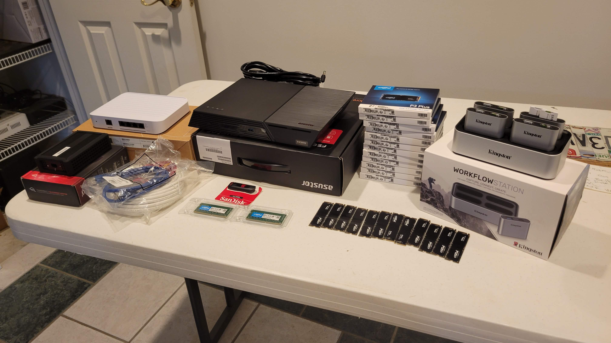

# flashstor
Creating a Asustor Flashstor Pro 12 to import SD Cards

[Austor Flashstor Pro 12](https://www.asustor.com/en/product?p_id=80) is a NVMe Flash Based NAS from Austor. It can hold 12 M.2 NVMe drives and supports 32gb of SODIM memory. The bootloader is unlocked and you can install any OS you want. I have chosen to install [ProxMox](https://www.proxmox.com/en/) as the host. On ProxMox I created a ZFS-2 array uinsg 11 Crucial 2TB NVMe drives. The 12th drive is the system drive. I have then mounted the ZFS drive in 2 other LXC containers. Container 1 is a vanila arch linux with Samba installed so I can share the ZFS volume over my network and the 2nd container is running [Plex](https://www.plex.tv/) from [tteck](https://tteck.github.io/Proxmox/). The Plex server is so I can view the media after it has been imported.

# Design Goals

The goal for this build was to have a portal NAS I could take into the field while recording audio and video and offload quickly in the evenings. Sometimes I will have upwards of 20 SD Cards that need to be offloaded and cataloged. Doing this one at a time or several at a time with various card readers from a laptop was proving time consuming and error prone. Previous iteration of this was a Synology NAS with a 4 bay card reader attached to the USB port, then using the Synology file manager to copy files from the SD Cards onto the internal Array. This worked well but I was loosing a spinning drive almost every time the NAS was relocated. So the decision was made to invest in NVMe drives and save the Synology for a single location backup. I also wanted something that could be edited from directly, the Synology was to slow to edit multiple 4k streams from.

# Hardware
1x  [Austor Flashstor Pro 12](https://www.asustor.com/en/product?p_id=80)
2x  [Crucial 16GB SODIMM](https://www.crucial.com/memory/ddr4/ct16g4sfra32a) - The Datasheet for the CPU states 16GB max but after running memtest86 on the 32 and testing proxmox the 32GB is working and being utilized
12x [Crucial P3 Plus 2TB PCIe M.2 2280 SSD](https://www.crucial.com/ssd/p3-plus/ct2000p3pssd8) - 1 for System, 11 for ZFS Storage
1x  [OWC Thunderbolt 3 10G Ethernet Adapter](https://www.owc.com/solutions/thunderbolt-3-10g-ethernet-adapter) - For connecting the laptop to the Flashstor
1x [Unifi Switch Flex XG](https://store.ui.com/us/en/products/unifi-flex-xg) - 10 GB Switch for the Flashstor, Laptop and main internet
1x [Kingston Workflow Station](https://www.kingston.com/en/memory-card-readers/workflow-station-hub) - Hub for SD Cards Readers
4x [Kingston Workflow microSD Readers](https://www.kingston.com/en/memory-card-readers/workflow-station-hub) - These got into the Hub and have support for 2 microSD cards each for a total of 8 microSD cards at once

# Software
ProxMox VE on Host
Arch Linux in LXC hosting Samba
Ubuntu Linux in LXC hosting Plex

Custom Scripts for importing SD Cards and rsyncing, located in this repo

# Building

